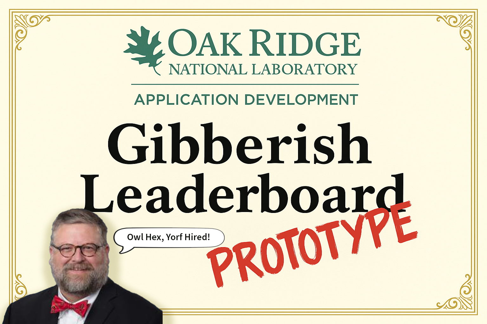

# 🧠 Gibberish Leaderboard App

> *"Of course Alex took my direction to incorporate AI into our development process and built an entirely unnecessary app using all 32 leading AI apps on the market, none of which are cyber-approved or vetted. Of course he did."*  
> — Jay, probably

<p align="center">
  
</p>

> ⚠️ **Note:** This is the repo for a prototype app that emerged from a fun game played at the  
> **2025 ITSD Application Development All Hands** meeting.  
> While the gibberish is nonsense, the tech stack (and spirit) are very real.

[](https://vercel.com/abellao-ornlgovs-projects/v0-gibberish-leaderboard-app)
[](https://v0.dev/chat/projects/3hd1d7oi67j)
[](#)
[](#)
[](#)
[](#)
[](#)
[](#)
[](#)

---

## 👋 What is this?

This app was created as part of a ridiculous-yet-powerful prototype built during the  
**2025 ITSD Application Development All Hands meeting** at Oak Ridge National Laboratory.

The goal?  
Recognize those who excel at **Enterprise Gibberish Interpretation** with an automatically generated certificate.

Also the goal?  
Show how **AI-assisted rapid prototyping** can deliver actual value to the lab—in this case, through humor, morale, and shared culture—without wasting precious time or resources.

🧠 Total dev time: **~37 minutes and 47 seconds**  
🎉 Total impact: **Several laughs. At least one sticker. Possibly a promotion.**

---

## ⚙️ Built with [v0.dev](https://v0.dev)

This app was built entirely in v0 using iterative prompting and “vibe coding” (i.e., not planning, just manifesting).  
It’s automatically synced with this GitHub repo and deployed via Vercel.

Explore the source code here, or…

👉 **[See the full v0 dev chat and fork it yourself](https://v0.dev/chat/gibberish-leaderboard-app-dEF9gR52aRO)**  
I left all my prompts and weirdness in there.  
Yes, including the part where I made it talk like a certificate. You’re welcome.

---

## 🚀 Deployment

**Live app:**  
[https://vercel.com/abellao-ornlgovs-projects/v0-gibberish-leaderboard-app](https://gibberish.0rnl.dev/)

**v0 build thread:**  
[https://v0.dev/chat/gibberish-leaderboard-app-dEF9gR52aRO](https://v0.dev/chat/gibberish-leaderboard-app-dEF9gR52aRO)

---

## 🛠️ How It Works

1. Build your UI and logic in [v0.dev](https://v0.dev)
2. Deploy it with one click
3. This repo syncs automatically
4. Vercel deploys from `main`
5. You impress your friends and confuse your coworkers

---

## ✨ Were you a winner and want to personalize your certificate?

👑 Visit [https://gibberish.0rnl.dev](https://gibberish.0rnl.dev) to claim your moment in history  
🏆 Submit your best gibberish phrases for leaderboard glory  
🪄 Or fork this and remix it for your own org/team

---

## 🤝 Contribute to the Chaos

Pull requests welcome for:

- New badge ideas (real or imagined)
- Ridiculous certificate variants
- Confetti explosions on hover
- Custom GIE titles (e.g. “Senior Manager of Mumbledom”)

---

## 📂 Repo Structure

```

GibberishLeaderboard/
├── components/
├── public/
│   ├── badges/
│   └── placeholder assets
├── app/
│   ├── layout, routing, and UI logic
├── styles/
├── README.md
└── LICENSE

```

---

## 🧾 License

MIT with a twist: if you use this to generate an actual SBMS policy, you must also create a badge for “Created in support of Alex Abell getting a raise.”
